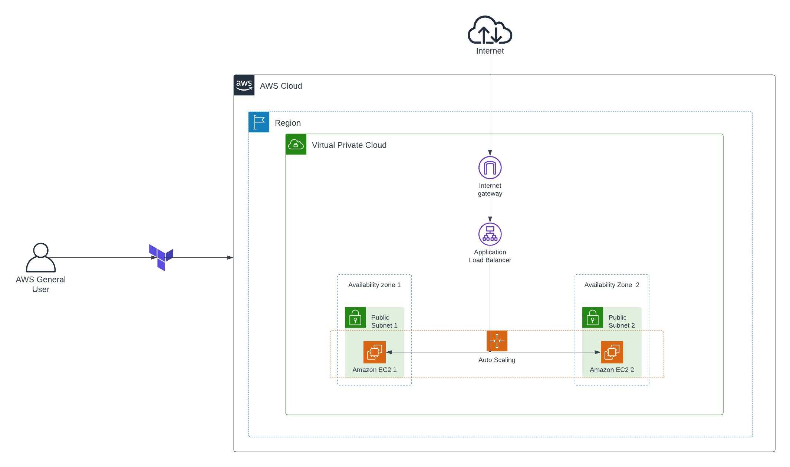

# Highly available and scalable infrastructure-using-terraform

## Day 4 of the 30 days of the Terraform challenge

## Description
This project uses Terraform to provision a basic AWS infrastructure that scales based on traffic and includes the following components:

A VPC with two subnets in different availability zones
* An Internet Gateway for internet access
* An Application Load Balancer (ALB) to distribute traffic to the web servers
* An EC2 instance running on Ubuntu with Apache HTTP Server installed
* A Security Group to allow HTTP and SSH access to the instances
* This setup is designed to be highly available and scalable by distributing traffic across EC2 instances in an auto-scaling group.

## Prerequisites

- [Day1,2, 3 and 4](https://github.com/chiche-ds/30-Day-Terraform-challenge-/tree/main)
- [Terraform](https://www.terraform.io/downloads.html) >= 1.0.0
- [AWS CLI](https://aws.amazon.com/cli/) (optional, if you are using a profile)
- AWS access keys 
- An AWS account(Free tier) with sufficient permissions (EC2, ALB, Security groups, VPC)

### Architecture diagram


## Getting Started

### 1. Clone the repository

Clone this repository to your local machine:

```
git clone https://github.com/william-me/scaling-infrastructure-using-terraform.git
cd Configurable-web-app-using-terraform
```

Configure AWS CLI with a profile
```
aws configure --profile your-profile-name
```

#### Run the following commands to initialize your Terraform project

```
terraform init
```
```
terraform plan
```
```
terraform apply
```
#### Destroy the resources
```
terraform destroy
```
